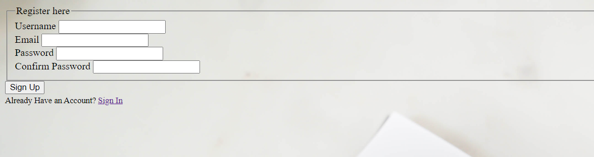

# Resume summarization and classification using NLP and OpenAI.

## Introduction
This repository contains a Python application for resume summarization and classification. It leverages Natural Language Processing (NLP) techniques and OpenAI models to extract key information from resumes and performs classification to categorize resumes based on job descriptions and provide summary for those resumes. 

### Instructions
To use the application, follow the steps below:

1. Clone the Repository: Clone the repository by executing the following command:

   git clone https://github.com/Sreeja-website/Resume-Summarization-and-Classification.git

2. Install Dependencies: Install the required dependencies by running the following command:

    pip install -r requirements.txt
   
3. Run the Application: Start the Python application by running the following command:

      python app.py

4. Register and Login: Once you run the application, you will go to a page where you can either register for an account with the necessary details or click on login if you already have an account. Once registered, log in to access the application.

   

5. Upload Job Description and Resumes: Upload the job description file and a folder containing all the resumes you want to process.

6. Submit for Classification: Click on the "Submit" button to initiate the classification process. The application will categorize the resumes based on the job description and you will get the required results.

7. Review Classification Results: Once the classification is complete, you will receive the classification results. Select the desired files for further processing.

8. Resume Summarization: Proceed with the summarization process on the selected files. The application will generate concise summaries for the resumes.

9. View Summaries: You can now view the detailed summaries generated by the application.

